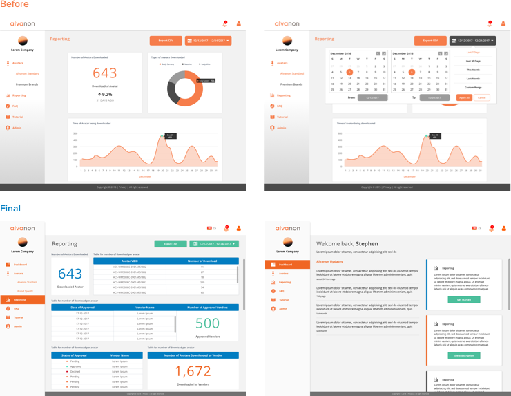

Alvanon is an innovative company in the apparel industry that makes clothes fit better and create sustainable processes; [Alvanon Body Platform](https://abp.alvanon.com/) serves as the central database of virtual bodies offering 3D fit standards AlvaForms model created by Alvanon for the global apparel industry. Operating on all collaborating 3D software systems.

Traditional fashion company like Alvanon has acknowledged to the power of digitalization and understood that the traditional way of shipping brand’s target customers’ body shapes and sizes is not enough. Therefore, a 3D avatar can enable brands and retailers to eliminate costs from physical fittings and sampling in the early stages while being compatible with most 3D garment simulation systems (Browzwear, Lectra, Optitex, Gerber, Clo3D).

### Example site-map

  

### Budget Proposal
There was few other candidates want to work on this project as well, therefore we have to create a simple, clear and sounding budget proposal in order to have a higher chance to get this job.

 

  

### User Flow & First UI Draft
 A basic user flow was created base on the first UI design draft, in order to ensure both the client, designers and enignners are on the same level of understanding of the functionality.

  

### User Interface Exploration
It inevitably happens that sometimes what designers think is different from their clients, we spent most of our time achieving the "High-technology" look and feel that Alvanon wants for the Alvanon Body Hub portal, therefore we have gone through few rounds of UI iteration. 

As this is a side project completely standalone with the Alvanon branding, we have to choose other corporate colors and the styling for this project. While ensuring that the information can occur presented clearly for the end-users.

  

### Website Design Exploration
We have also tried to explore different style for the body hub website landing design. We decided to go for a simplier color tone which goes well together with the portal design so that the users are still aware that they are still using alvanon webiste.

  

### Personal Experience
I like the overall design and implementation of this project. Having a chance to witness how the traditional apparel industry digitalizing their internal process and using innovative technology to disrupt the traditional way of doing things was remarkable.

I enjoyed working with Alvanon's technical team lead, the project was very fast, it lasts less than a month. A pity, that we don't have enough time to conduct user studies and research. Everything was somehow based on the industry's several years of doing things and personal work experience. Having said that, I still find this project a great success. I would like to thank you another UX designer Sam who supports me and work along together on this project with me. I am also glad that Sam gets to learns a lot from this project under my step-by-step guidance and he got his first full-time job as a UX designer. That was one of the incredible things that happened in my life. 

>> Living to create a positive impact on others' people life. 