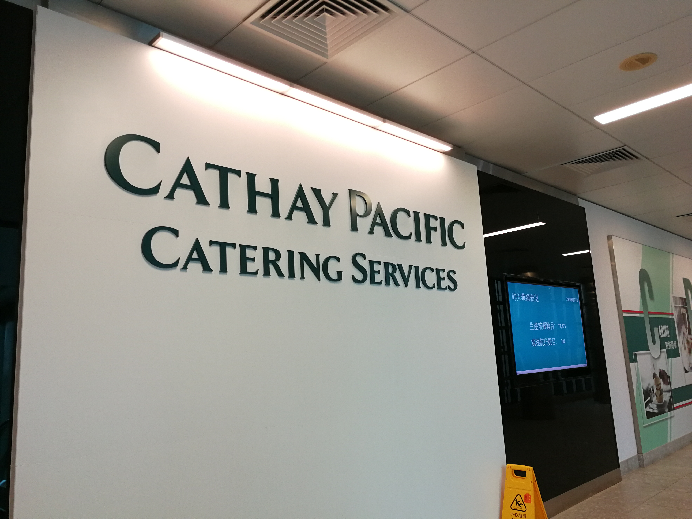
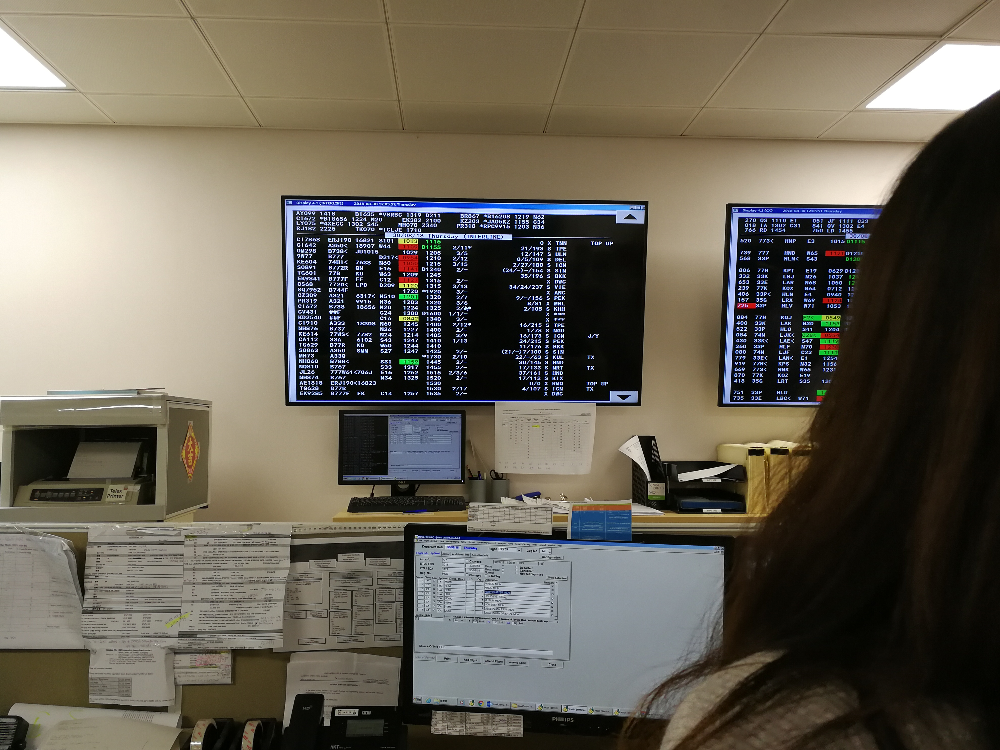
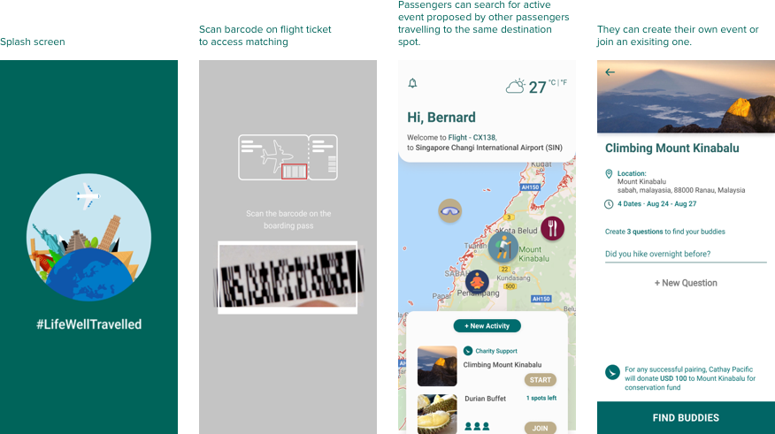

I was in the [Cathay Pacific 24-hour Hackathon](https://hackathon.cathaypacific.com/), it is the only aviation-related hackathon event in Hong Kong. It brings together young innovators who are passionate about aviation and technology. Teams will work together to brainstorm, develop and pitch innovative technology solutions to a panel of influential industry professionals.

### Visiting Tour at Cathay Pacific Headquarters

  

  

aviation-related hackathon event in Hong Kong. It brings together young innovators who are passionate about aviation and technology. Teams will work together to brainstorm, develop and pitch innovative technology solutions to a panel of influential industry professionals.

### Problem Statement
Cathay Pacific is a long historical aviation company in Hong Kong and it has recognised as the top world wide airline in 2018. It is renowned that Cathay Pacific is a brand score with 5 stars. However these days customers have higher expectation when travelling by plane, it has become a phenomenon that not only the in-flight experience is important but so as the experience after landing. Therefore our problem statement is **"How might we re-create the experience after landing?"**. 

### Solutions

  

 

We come up with the idea of tavel-buddy platform, where mots of the passengers who are taking the same flight are suppose travelling to the same destination spot, it can be either leisure or a business trip. Passengers who is travelling alone or in-group can create or join exisitng events that raised by other passengers. With this idea, Cathay Pacific is connecting its own passengers from sky to land and the whole experience is being considered.