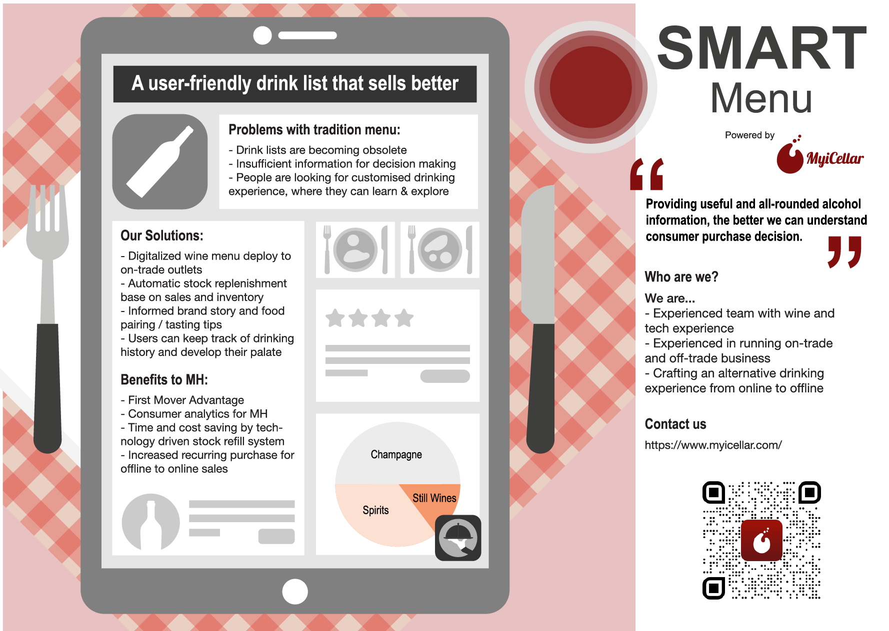
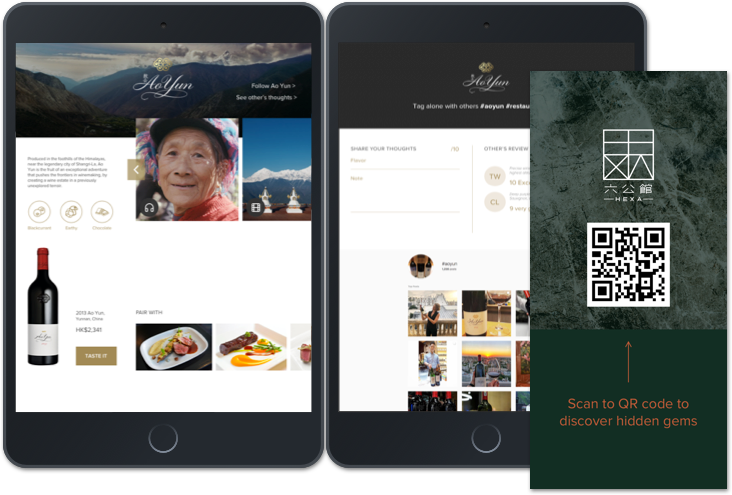

Moët Hennessy is the Wines and Spirits division of LVMH. The group of 25 wines and spirits Maisons is like no other in the world. This is a joint acceleration programme offered by GAA from HKSTP (Hong Kong Science and Technology Parks Corporation) and Moët Hennessy Asia Pacific, who supervises the marketing and distribution in the Asia Pacific Region. In this project, it was my honour to represent my company MyiCellar and having the chance to work with Digital Marketing Director from Moët Hennessy to create innovation solution to disrupt the Wine and Spirit industry with new retail experience. 

### Business Challenge
1. Help crafting crafting a "New Retail" luxury experience to consumer both on & offline.
2. Increase visibility in both retail & on-trade environment
3. Big data analysis to better understand and engage consumers

### Product Proposal

  
   
    
   
  
  
  
  
  

### Solution
**Digital Wine Menu** was presented in this acceleration programme. Traditional wine menu is confusing and does not provide further information for example the most important for wine and dine is the wine pairing experience. 

  

  

### Problem Statement
Base on the exisiting problem of traditional wine menu, we have come up with few HMW questions: 

1. **How Might We get more understanding with the brand story and pairing suggestion**

2. **How Might We better understand our customers**

3. **How Might We engaged with wine fans**

### Pilot Test
We have selected 3 pilot restaurants and estimated 2 months implementation and validation.

### How Moët Hennessy can be benefited?
We believed that a Digital Wine Menu could be seamlessly adopted and a digital menu could potentially improve sales for LVMH brand by 7%.

We believe the impact could be much higher for example it is eco-friendly, allow online marketing campaign, create an inventory-less restaurants and it can be the first online point of sales from restaurants.

### Outlook
MHD and GAA really like our solution and we became one of the shortlisted finalist. This experience of taking part in the acceleration programme has benefit my learning curve a lot in terms of gaining the business perspectives and insights. The acceleration programme also comes with a series of intensive training, from there I was able to take part in many entrepreneurship lesson, from corporate taxation, funding and digital marketing. I would like to thank you MyiCellar allow me to take the lead and driving this project.