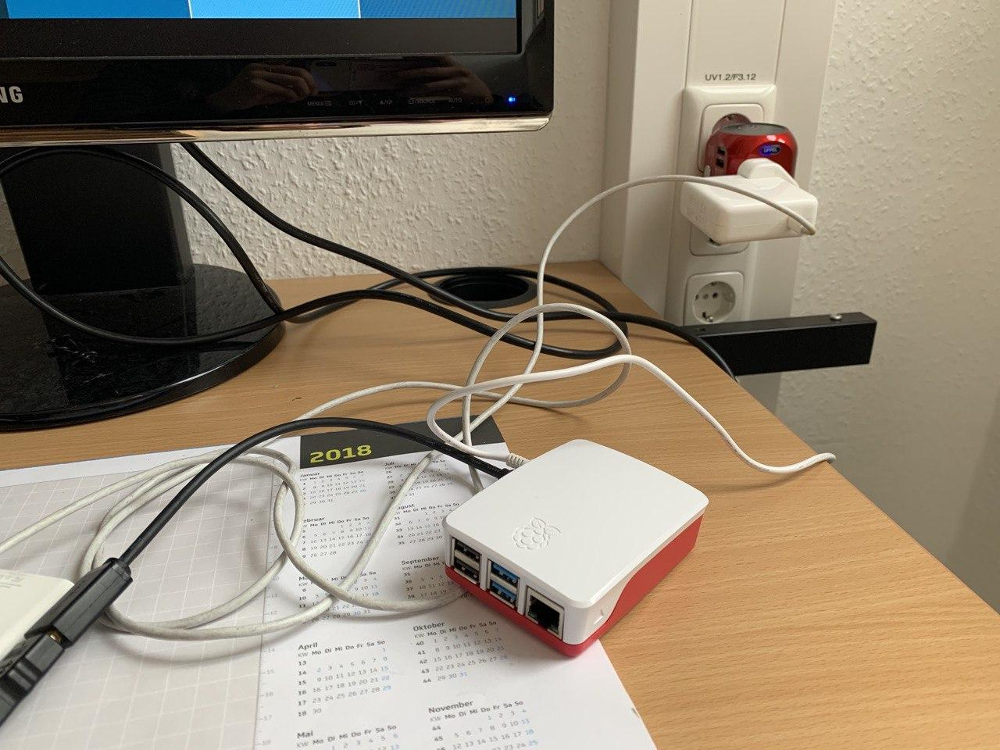
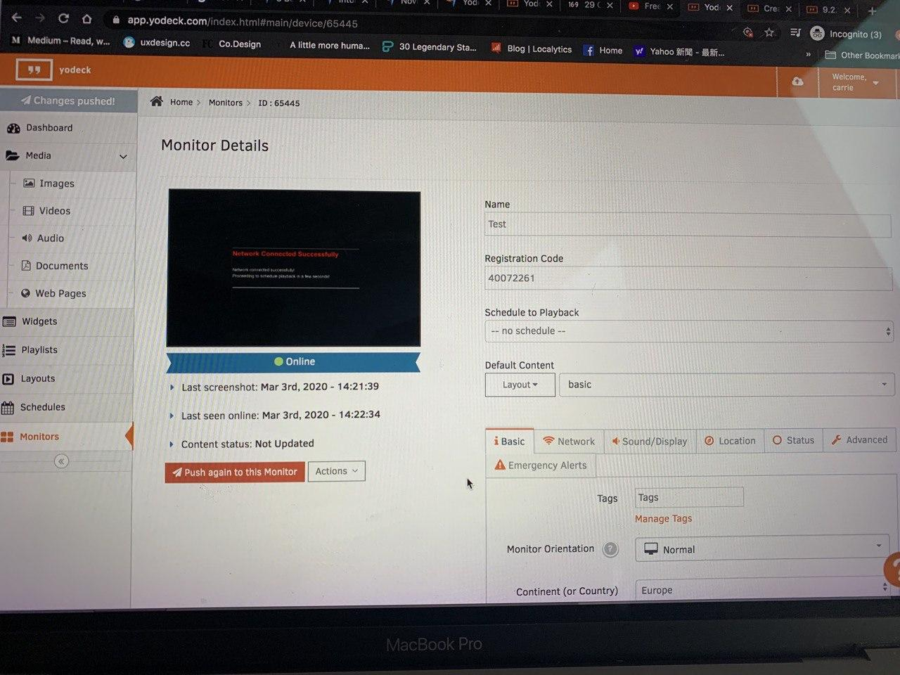
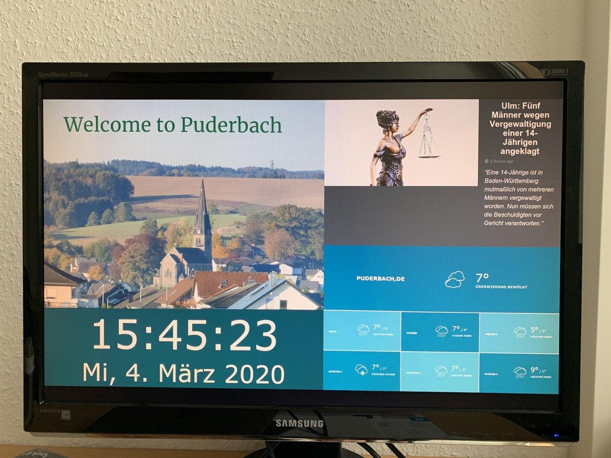
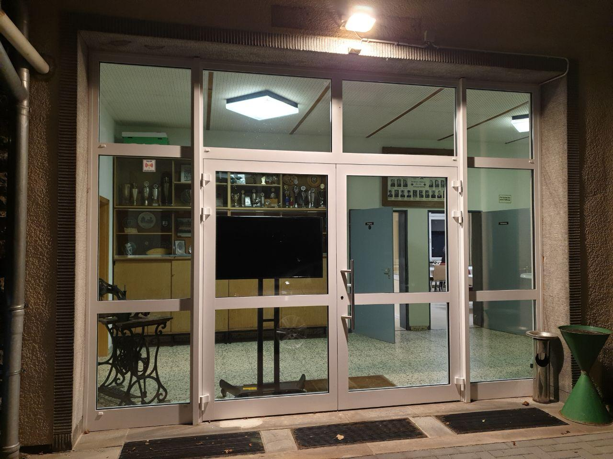
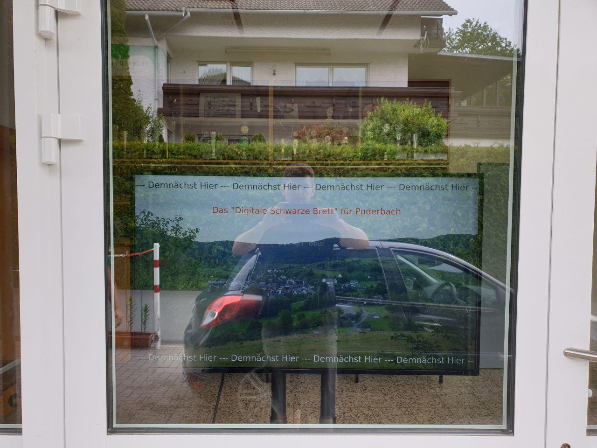
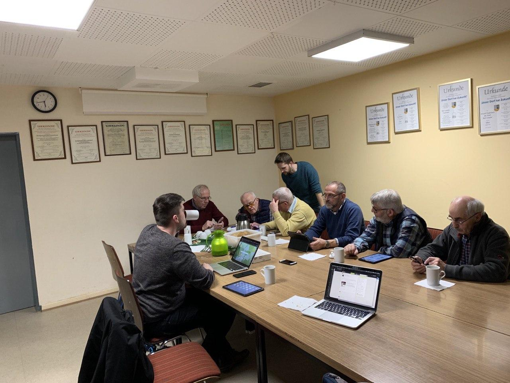

I was helping in this project as a student assistant at the Universität of Siegen. The concept is that digitization can contribute to a better quality of life in rural areas. The project takes place in three main villages as a model village, they are Arfeld, Raumland, and Puderbach.

### Project Background
In the small village of Puderbach with around 500 inhabitants, there are a total of 13 information boxes on which the activities of the village and the clubs are made known. If dates change, one person will be busy for at least one hour to go through all the boxes in the village and to exchange the notices. 

Therefore the idea is to create a digital bulletin board that can also be controlled from home would enable quick, uncomplicated updates. Event information could be combined with general information on the projects and activities in the villages, supplemented by a presentation of the associations with the relevant contact persons in the village.

### Solution
A [public screen](https://www.digitale-dorfmitte.de/projekt/public-screen/) in the village community center that is visible from the outside through the glass door and can be controlled via an app. Mounted mobile on a stand, the screen can also be used for events in the village community center, from technology cafes for all generations to watch football together or anything conceivable.

### Digital Bullentins using Raspberry-Pi

  

  

In this student job, I was able to suggest and implement the chosen digital signage software. Playing around with Raspberry-Pi was fun, I was able to install Yodeck on top of the device, it is a cloud-based digital signage software platform.

### Testing the Digital Signage

  
    
  <figCaption>Before installation the digital board at the community hall</figCaption>
    
    <figCaption>Final installation with the help from my colleague</figCaption>

### Participatory Design
It was also a precious chance for me to experience Participatory Design (PD) in this student job. PD is a research methodology that includes all the stakeholders at the early design and prototype process. Since we are cooperating with nebenan.de in this project, therefore, we want to find out if the inhabitants at Puderbach like to use it and whether they know how to use it. 

  
  <figCaption>Teaching members to use nebenan.de</figCaption>

