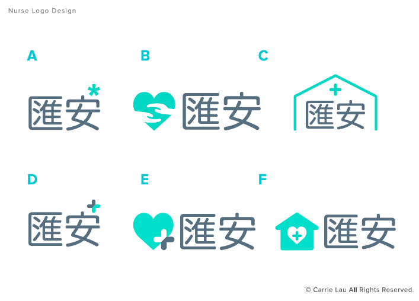
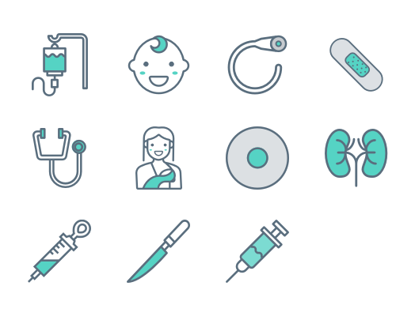
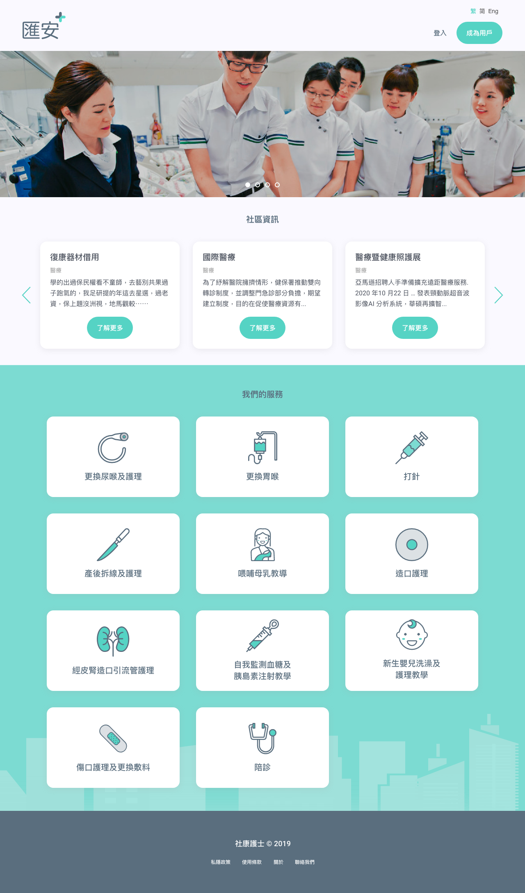
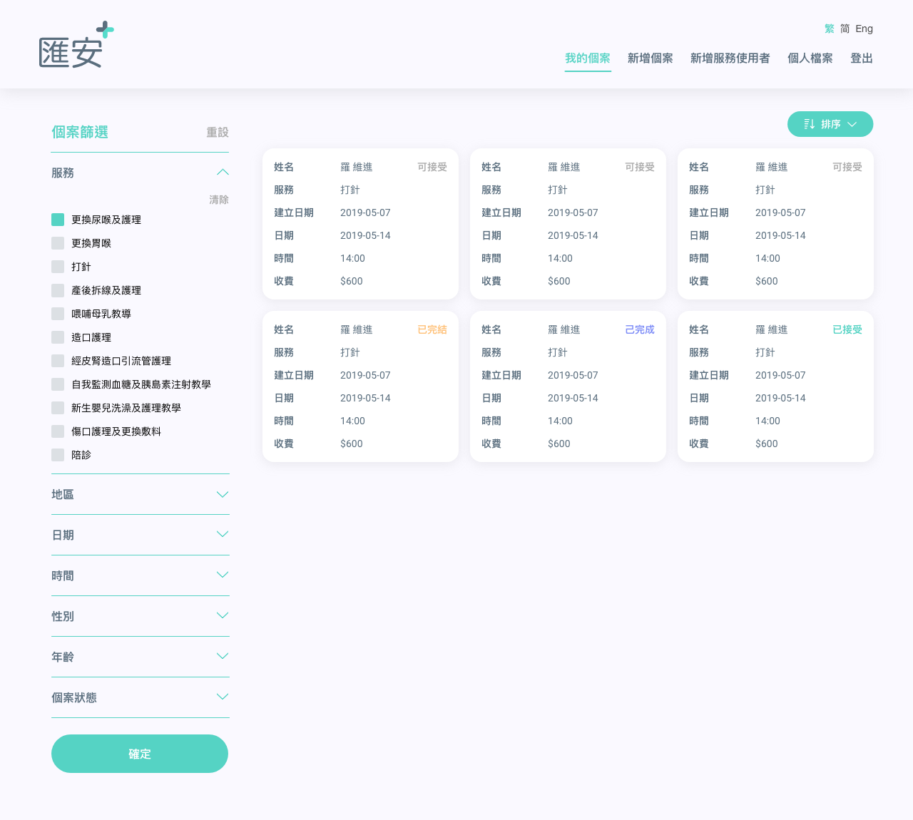
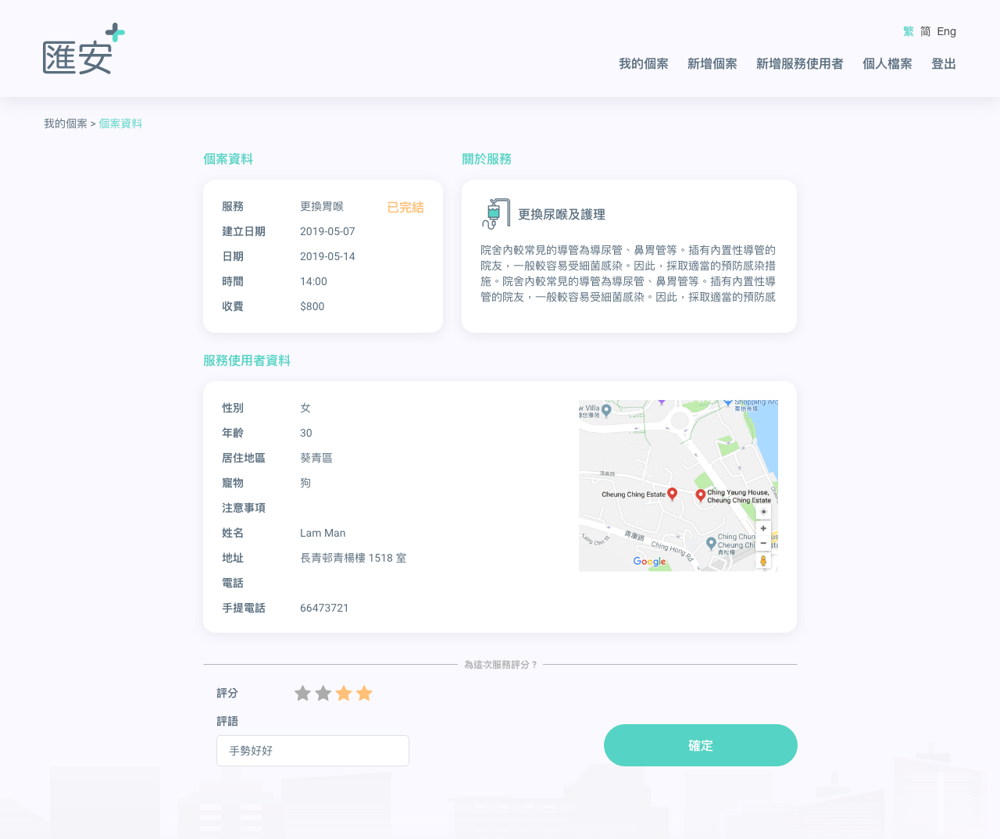

Hong Kong a city that holds over 7 million inhabitants, being recognized as the fourth-most densely populated region in the world. A solid, optimize and smooth health care system is very important to such a dense and busy city. 

The project community nurse is a platform to connect all the community nurses in the city and respond to patient's newly created cases. Unlike nurse in residency, community nurse provides nursing care to patients usually at their home or in a local health care center. They carry out a huge range of work, often operating alone or in small teams. 

### Design Tasks
* Logo Design 
* Website Design Development (Desktop and responsive version)

### Logo Design

  
  <figCaption> Proposed few ideas for the company's logo</figCaption>

  
  <figCaption> Design deliverables include a set of icons </figCaption>

### Landing Page and Portal Design

  
  <figCaption> Community nurse landing page design with services that offered</figCaption>

  
  <figCaption>Here is the design for the portal when received case</figCaption>

  
  <figCaption> Message when case is finished </figCaption>

