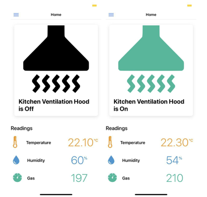
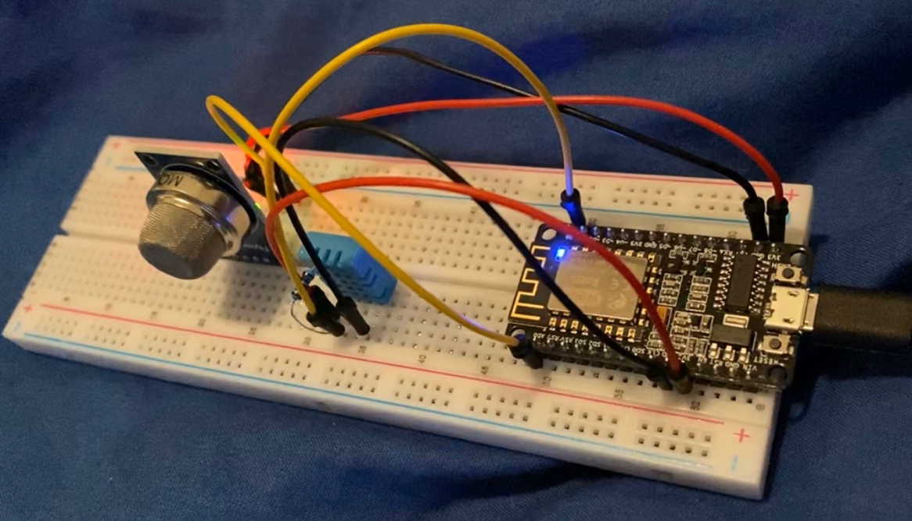
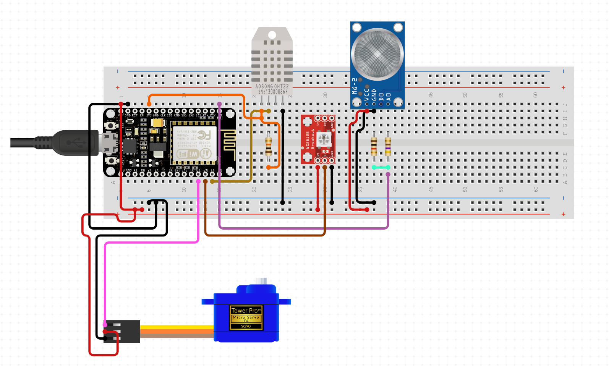
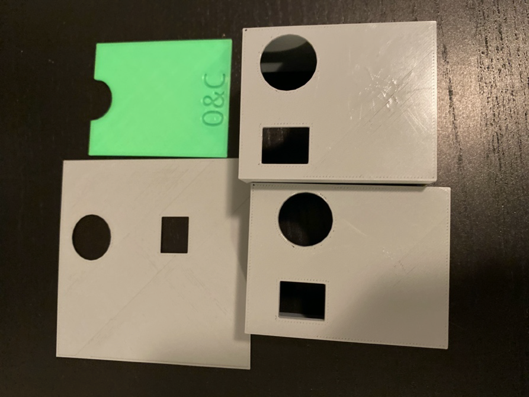
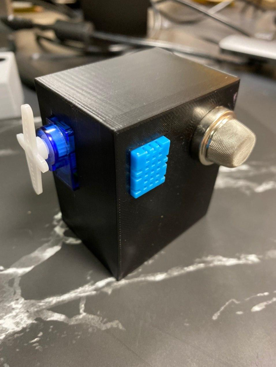

In this project, we have created a prototype for an automatic kitchen ventilator, which turns on automatically once someone starts cooking, using multiple sensors like temperature, humidity and gas particles concentration sensors.

The project is shipped with a monitoring cross-platform mobile app that indicates whether the kitchen ventilator is on or off, and also shows the current live values of temperature, humidity and gas particles concentration.

### IoT and Energy Efficiency
In the pre-IoT era, the traditional energy-management system would collect a sample of energy usage at an interval. The traditional system is good to get energy-consumption data, but it doesn’t help you with alerts in case of spikes, curating usage pattern, predicting the seasonal demand, or suggesting appropriate configuration.

Also, in the pre-IoT era, the motor load test was a lengthy and cumbersome affair. Engineers used slip tests and electrical tests with a digital stroboscope. They had to spend hours with the equipment to obtain samples. Even then, the data collected was only a sample, and not real time.

With the IoT in place, the analyses can occur on real-time data from the motor. That makes the analysis quick, painless, and more accurate. IoT brings real-time alerts, ability to predict energy demand, usage patterns, and ways to optimize energy consumption.

### Motivation
With the advance development of Internet of Things (IoT), we can make use of the technologies that bring convenience and services for the smart home consumers. By definition A smart home is a place with heterogeneous systems to many front devices with the support of embedded information and communication architectures.

  
  
  <figCaption> Mobile application for kitchen ventilator UI mockup </figCaption>

There are many benefits when implementing this automatic kitchen ventilation system, for example cooking in an energy efficient and eco-friendly way.
Automatic kitchen ventilation system also relied on a heuristic approach when kitchen users forget to turn on the ventilation while cooking and that can lead to fatal domestic inhalation injury from hazardous gas.

In this prototype project, we have built an automatic kitchen ventilation system. There are several motivations behind building this system. However, the main goal is to establish a positive cooking experience for kitchen users that not only enjoy the time when cooking but also saving energy when cooking.

### Supplies and Sensors
For this project, we have used the Osoyoo NodeMCU IOT Programming Learning Starter Kit, which provided us with the main and basic supplies needed for any IoT project, we have also used some other sensors and supplies that were not provided by the kit in order to make the prototype.

Below is a list of the used supplies:
- 1x NodeMCU Micro-controller (ESP8266 Wi-Fi SoC)
- **1x MQ-2 Gas Sensor**
- 1x DHT11 Sensor
- **1x 3D-Printed Housing (box & cover)**
- 1x SG90 Micro Servo Motor
- 1x Solderless Prototype Breadboard
- **1x RGB LED**
- 1x 10Kohm Resistor
- 1x Micro USB Cable
- **1x Power Bank**
- 13x F/F Jumper Wires

Where the supplies in bold are the ones that were not provided by the Osoyoo NodeMCU IOT Programming Learning Starter Kit.

### Software 
For making this project, we have used Arduino IDE to configure the NodeMCU, we have also used TinkerCad for designing the 3D model of the casing and cover, as well as WebStorm, XCode, Android Studio, Firebase, Laravel for the mobile app, Photoshop was also used for editing graphics in the app.

### Procedure
For prototyping we have used the Solderless Prototype Breadboard, which helped us connecting and testing all the sensors and connections.

  
  <figCaption> Sensors Connections Testing </figCaption>

The sensors as well as the servo-motor and a feedback RGB lights were all connected directly to the NodeMCU with their respective resistors, as seen in the following diagram simulation.

  
  <figCaption> Breadboard Simulation of Circuit Connections </figCaption>

After making sure that everything is working correctly, we starting 3D modeling the housing for the prototype, and the cover, were we decided to go with the most minimalistic and smallest possible design. So, we created a box that fits all of the sensors, feedback components as the Fan and the RGB
LED, as well as the NodeMCU.

Multiple models were printed out until the final result was achieved, as seen in the figure below.

  
  <figCaption> 3D printing attempts and drafts</figCaption>

### Results
Finally, the components were packaged, connected and tested in a real environment, through the feedback components as well as the mobile application, were the final results can be seen in the
following figures.

  
  <figCaption> Final Prototype (Front)</figCaption>

