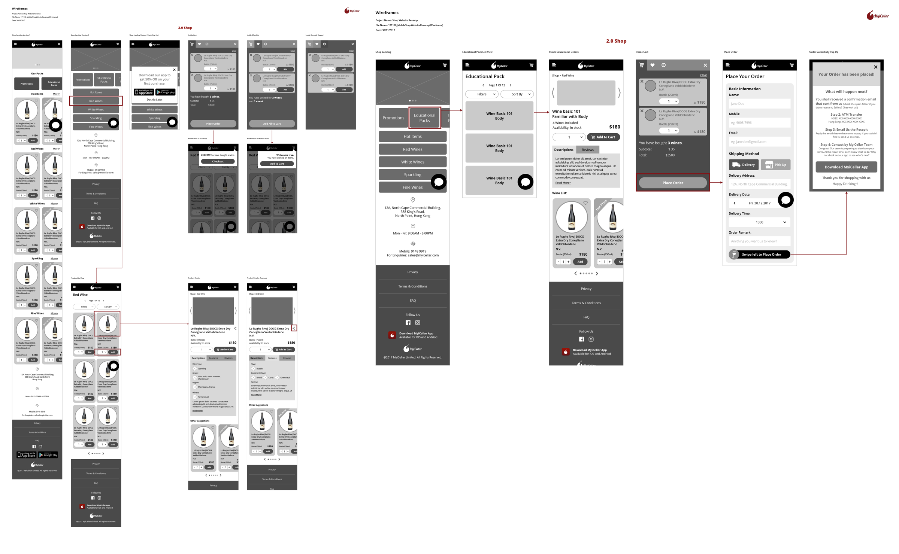
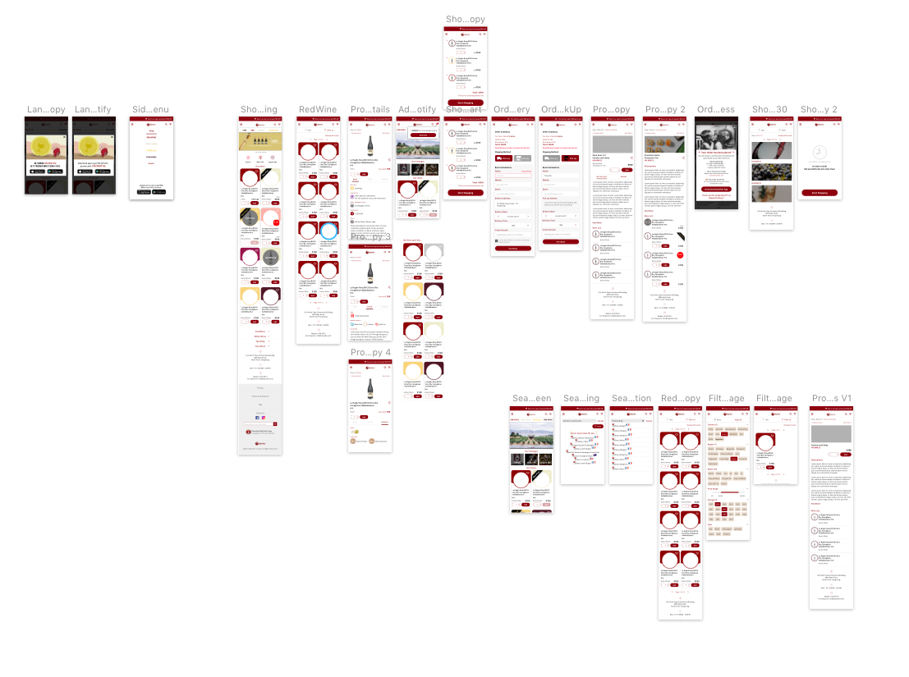
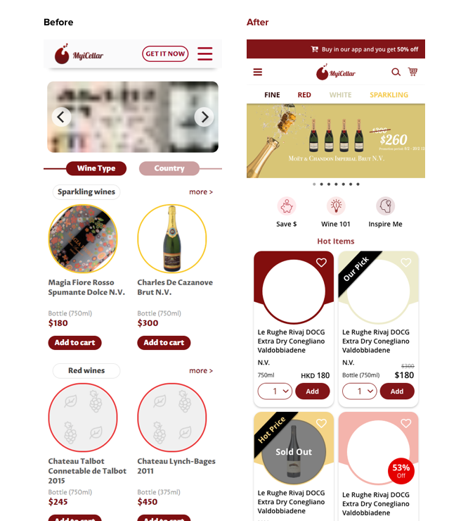
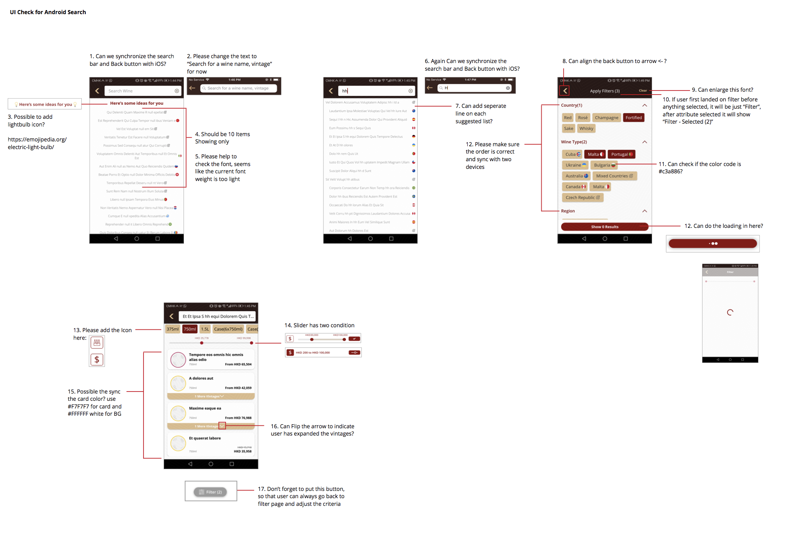
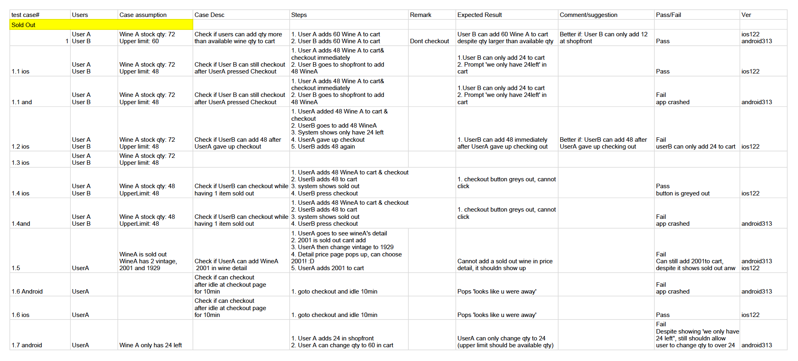
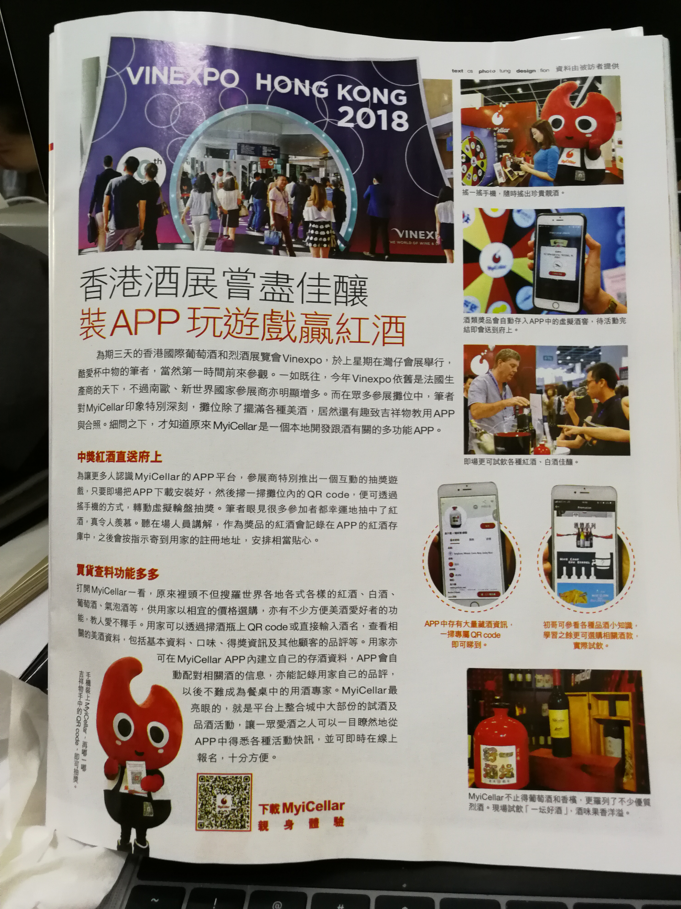
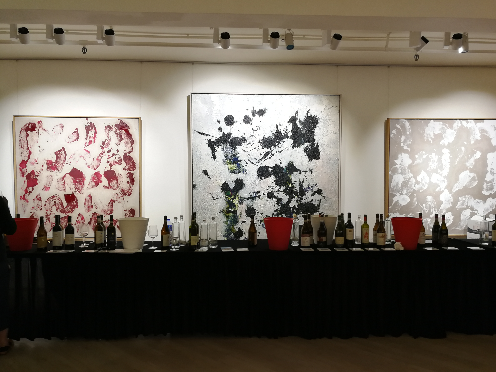
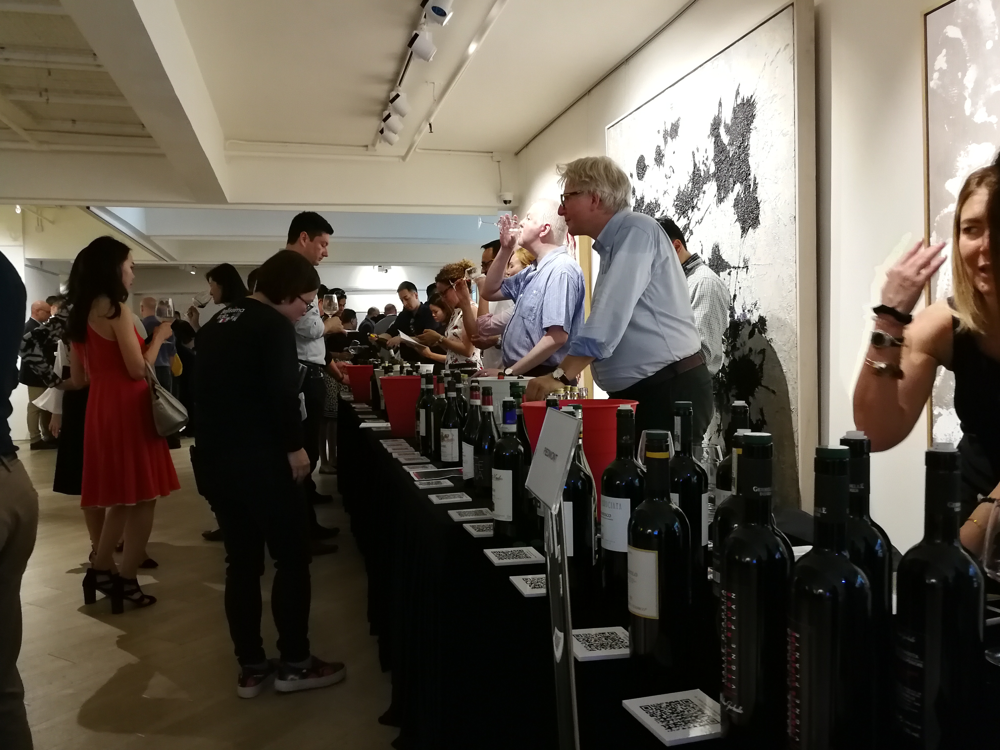
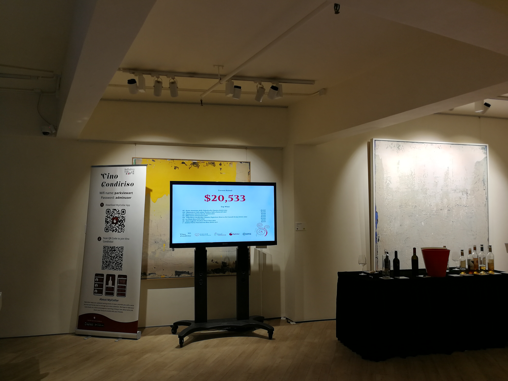

Working in [MyiCellar](https://www.myicellar.com/?lang=eng) for more than 1 Year as a project manager was truly a great benefit to my personal and career development. During this time, I learned a lot and acquire many new skills. Coming from a design and UX/UI background, I would say my position in MyiCellar allows me to work on the project with a business and growth mindset while balancing the user experience for our product users, and leading other design juniors as well, it has been such a remarkable journey for me. The followings are only a few projects I have picked to showcase. 

### Corporate Brand Identity
The first task and an on-going task when I was working at MyiCellar was to redesign the brand identity MyiCellar, the previous logo was having too many color variations and some of the colors are not print-friendly. Therefore when it comes to printing, it was very hard to print the logo with the right color on printed materials. Also, there was no documentation for the brand guideline, as MyiCellar have a lot of O2O (offline to online) campaign, it is crucial to have one source of truth where different departments can access and applied the same style for the corporate identity.

<iframe src="https://onedrive.live.com/embed?cid=0E75A4277FED839B&amp;resid=E75A4277FED839B%21133&amp;authkey=AHkmqON5tG07B5E&amp;em=2&amp;wdAr=1.7777777777777777" width="610px" height="367px" frameborder="0">This is an embedded <a target="_blank" href="https://office.com">Microsoft Office</a> presentation, powered by <a target="_blank" href="https://office.com/webapps">Office</a>.</iframe>

### UX/UI Design - Wine Shop Website Revamp
When I first come to the company, there are some problems with the online shop website. For instance, it is not easy for people to differentiate the types of wine, and with more products coming to the platform, MyiCellar's website needs to support more functions such as in-App wine search and filtering. Therefore the architecture of MyiCellar website need to change and improve for better user experience. 

  
  <figCaption>Wireframe draft for website revamp</figCaption>

  
  <figCaption>Preparing user interface design assest for development team</figCaption>

  
  <figCaption>The final result of old and new shop landing</figCaption>

### Product Management - New Features Launch and App Testing
Being a product manager, allows me to learn shifting a design-only mindset to look at the product in a bigger picture. For example, designing test use cases to follow up and validate whether the function is well implemented. I was giving a lot of chances to attend many business development meetings and to discuss the product roadmap. All these experiences have allowed me to learn to become a better product manager.

  
  <figCaption>UI check screen explaination</figCaption>

  
  <figCaption> MyiCellar search function test use cases</figCaption>

### Exhibition Kiosk & Auction Event 
One of the challenges when working in MyiCellar is that many small projects in between need to deploy in a smaller time-frame. On the other hand, these projects usually are temporary, therefore as a Product Manager, I need to make sure these temporary changes can be chunk down into smaller deliverable tasks that the development team has sufficient time to deploy while making these changes won't affect existing users on the platform. 

  
  <figCaption>MyiCellar booth at VineExpo</figCaption>

One of the interesting projects I came across is to create an exhibition kiosk at one of the famous wine B2B exhibition called VineExpo. MyiCellar wants to design a kiosk that can attract passed by visitors to stay and chat with our staff. Therefore, we create an entry point in the MyiCellar app where visitors can scan the QR code to enter the lucky draw, when they shake the phone, the monitor will display what the visitors can get from our booth.

  
  <figCaption> MyiCellar wheel game was on the news after the exhibition </figCaption>

Another project is MyiCellar cooperating with a local art gallery for a charity event. It is a wine auction night where wine tasters can walk around and taste over a hundred wine bottles while using our app to understand the terror and history behind each wine bottle from the winemakers. On the other hand, every user that purchases via a dedicated link in the MyiCellar app will be recorded and reflect on the screen as a charity donation.

  
  <figCaption>Wine tasting with local Hong Kong Art Gallery</figCaption>

  
  <figCaption>Visitors doing wine tasting and meeting all the wine makers from different region</figCaption>

  
  <figCaption>Wine auction event night with Vino Condiviso</figCaption>

