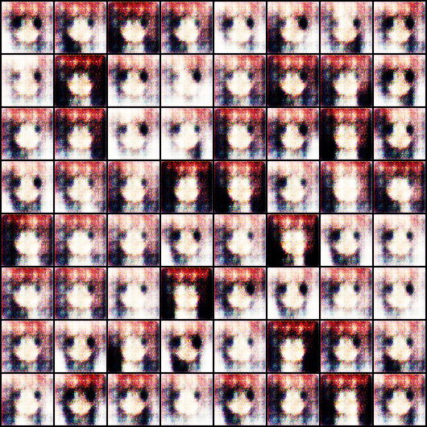
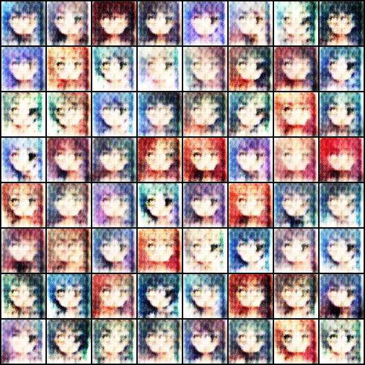
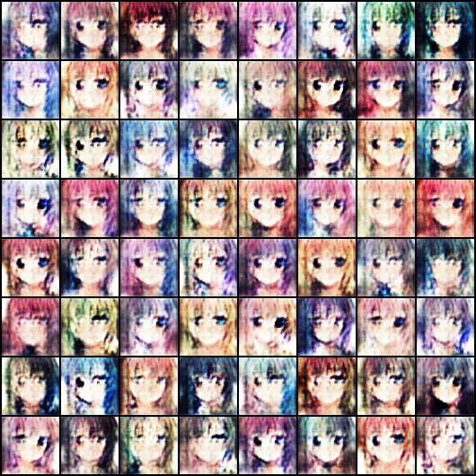
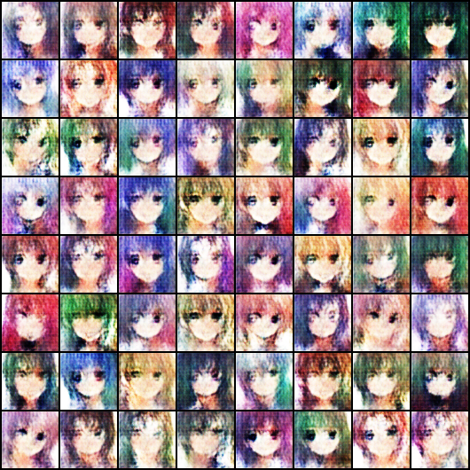
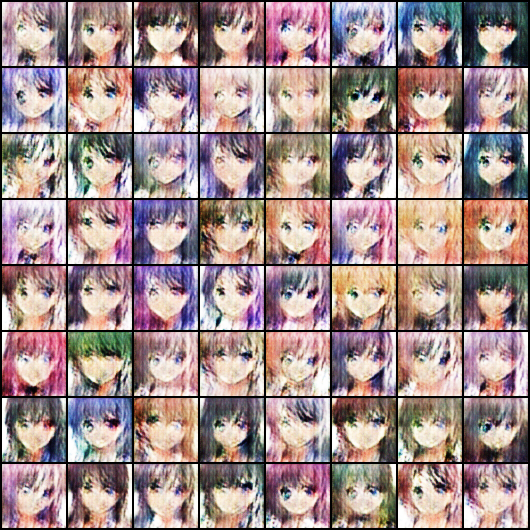

### Abstract 

In this project we were given an anime face dataset which contain 36.7k high-quality anime faces and we have to define and train a GANs network in order to generate more different style of the anime faces. After we downloaded the dataset, we have to apply pre-processing and then load the data. After that we have to define the GANs network which contain two adversarial networks, a discriminator and a generator. First we defined the discriminator class to detect whether a given image is fake or not. After that we have to define the generator class to generate images. Furthermore, we evaluate the network by calculating the discriminator and generator loss. We then define Adan optimizer to improve the result. Finally we train the model and visualise the result.
  
### Data 
We obtained this dataset from Kaggle platform, [Dataset](https://www.kaggle.com/lunarwhite/anime-face-dataset-ntumlds) The dataset consisting of 36.7k high-quality anime faces scraped from www.getchu.com, which are then cropped using the anime face detection [Algorithim](https://awesomeopensource.com/project/nagadomi/lbpcascade_animeface). The image size we are giving here is vary from vary from 90 x 90 to 120 x 120. However, we can further preprocess the data and apply resize according to our choice. The dataset not only contains high quality anime character images but also comes with clean background and rich colors, which makes it easier for implementation.
First we have to preprocess the data and that include applying some transformation on the data, such as resize, center-crop and normalize. It is also possible for us to try to use other data augmentation function such as ColorJitter and GaussianBlur on the dataset. After that we defined a class for our data and then load it on the training devices with Dataloader

### Methods
To approach the problem, after preprocessing the data, we have to define the architecture for the model. As mentioned before, the whole GANs network consists of two model. The generator and the discriminator. For these two classes, we first define the architecture for the discriminative model. The discriminative model contain 5 convolutional layer. After the first convolutional layer, we applied Batch Normalization and then LeakyReLU activation function. We stacked these layers up for five times, then flatten it and pass to final Sigmoid function. That make us get an output of scalar, which is a probability from the training instead of the generator that detects whether an input is real or fake.

For the generator class, it utilize the input of a latent code. A latent code is simply a representation of compressed data in which similar data points are closer together in space. It is useful for the network to learn data features and finding simpler representations of data for analysis. Similar to the discriminator model, however in here it contains five convolutional transpose layer instead with the input of latent size. After that, it also followed by batch norm and relu function. At the end we pass it to an activation layer using Tahn function.
For the loss function, we have to calculate both loss for the discriminator and the generator loss. The discriminator loss is the sum of the losses for real and fake images. As for the generator, generator loss will look similar only with flipped labels. The generator's goal is to get the discriminator to think that generated images are real. There is also other suggestion for training generator loss in GANs. Such as calculate the generator loss from the discriminator’s classification and gets rewarded if it successfully fools the discriminator, otherwise gets penalized.

    
    <figCaption>Figure 1 Discriminator and Generator Loss during training on “cpu”</figCaption>
    
    <figCaption>Figure 2 Discriminator and Generator Loss during training on “gpu”</figCaption>
    

From figure 1 as we can see, the challenge in here is that relying on MacBook’s cpu is not powerful enough to run a higher number of epochs. Compare to figure 2 where if we can run with a powerful gpu which allow us to run more epochs, we can get more result of how the training losses differ during trainings. Here is how we can interpret the losses, for the generator, loss decrease immediately for few epochs. Which indicates that during these epochs, discriminator could be too weak to identify and get fooled by the generator. On the contrary, if discriminator loss decrease immediately, it means the discriminator is too strong at that point and that generator is not generating images which are realistic enough.
From the lecture, we learned that we can use loss function to measure the goodness of our function. However, we can’t just pick a single loss value to determine whether the network is good or bad, because a good GANs network, its loss is always fluctuated just like what has been shown in figure 2.

### Generated image from running 5 epochs

    
    <figCaption>First generated results from 1st epoch</figCaption>
      
    
    <figCaption>Second generated results from 2nd epoch</figCaption>
      
       
    <figCaption>Third generated results from 3rd epoch</figCaption>
      
       
    <figCaption>Fourth generated results from 4th epoch</figCaption>
      
        
    <figCaption>Last generated results from 5th epoch</figCaption>

### Conclusions
All in all, I think this an interesting project and I enjoyed working with deep learning regarding to this topic. It is a great satisfaction to see how the computer can learn by itself to create these color anime faces. In this project, I have also faced a few challenges. For examples, I am not able to run the code on macbook’s gpu, therefore I can only run the code relying on the cpu. However there is a great limitation when perform training using computer’s cpu. As a result, each epoch took up to 47 minutes to generate one result images. To solve this problem, I have then tried to run the code on google colab and configure to use the gpu which allow me to run more epochs to get a better representation of the result.
It would be fascinating to see more research in the future regarding the GANs network and how to optimize the architecture when applying GANs on different domains.